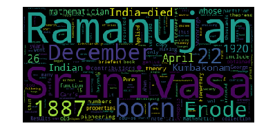

# Final project of *Crash Course on Python By Google* on Coursera:
## Word Cloud☁️
- In this final project, I made a word cloud in Python.
- Just upload your own text file, for example here I made a Ramanujan.txt file that contains info about our famous Indian Mathematician *Srinivasa Ramanujan* from Britannica article.
- The program will just remove the unwanted words(articles, proverbs) and punctuations and then it will make a word cloud in the form of a picture using wordcloud library.
- Here's my txt file's word cloud dedicated to our Mathematician:
